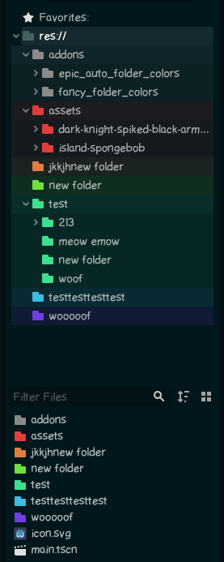

# GodotEpicAutoFolderColors
Automatically changes folders color in godot inseppctor!1!

idk how to make plugins tho - aka my first one

# WARNING FOR ALPHA VERSION (0.8)
It works - end result is as shown below BUT with some extra steps (ig because its literally editting project.godot file lol)... 

## Preview

## Settings
**Don't Check Sub-Folders** - only res:// folders will be collored but not their sub-folders.

**Sub-Folders Color By Layers** - color sub-folders starting from on how deep is it, otherwise sub-folders are colored by next color index (counting from its parent color index).

**Merge With Old Config** - add old (not overwritten) folder color settings - useful with "Don't Check Sub-Folders" option for custom sub folder colors

## Mentioned Extra Steps (temporary):
1. In "Epic Debug Panel" (at bottom panel):
    1. Select color options
    2. Click "Manual Change Folder Colors" button to change colors
2. Wait for "The following files are newer on disk: project.godot" popup (alt+tab'ing works)
3. Click "Reload from disk"
4. In "Epic Debug Panel" click "Refresh File System" button to see changes (or alternativly just refresh it manually by adding folder/chaning name of file/folder etc (interact with filesystem tab))

*I will make it more automatic in free time I swear.*
