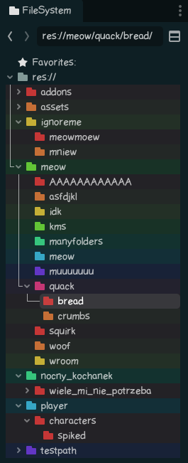

# GodotEpicAutoFolderColors
Automatically changes folders color in godot inseppctor!1!

idk how to make plugins tho - aka my first one

## Preview

## Settings
**- soon -**

*Soon I will make it more customizable like custom paths, ignore paths, colors etc!*
